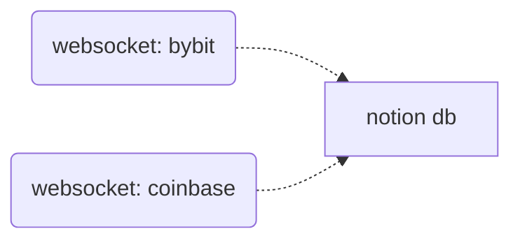
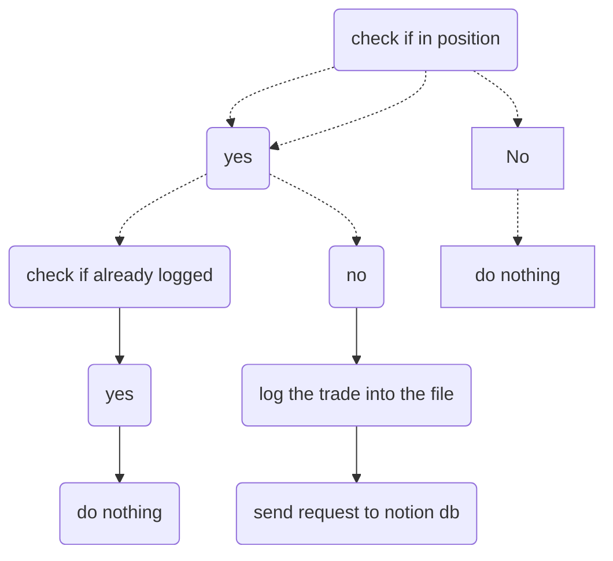

# 1. Seamless Journal

Real-time Journal for Notion

The Seamless Journal provides near-real-time tracking of positions entered and exited on various exchange platforms and subsequently updates a Notion database.

---

- [1. Seamless Journal](#1-seamless-journal)
- [2. Documentation](#2-documentation)
  - [2.1. Process](#21-process)
    - [2.1.1. Main process](#211-main-process)
    - [2.1.2. Websocket Bybit](#212-websocket-bybit)

---

**TODO**:
- Integration
   1. ~~Bybit~~
   2. Coinbase
   3. Oanda
   4. Binance
- Combine `websockets` and deploy on a server

# 2. Documentation
TODO:
- add requirements
- add environment

## 2.1. Process
The process currently caputres entering positions into a Notion database and checks if a trade has already been logged on the remote database.

### 2.1.1. Main process

### 2.1.2. Websocket Bybit

